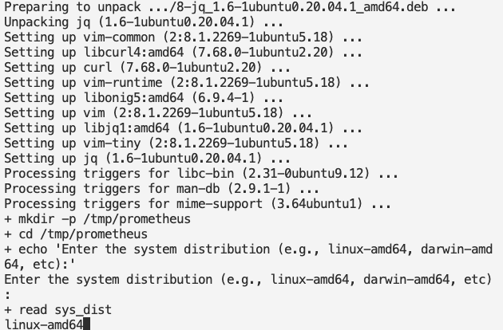

# Monitoring Jenkins Server with Prometheus and grafana


Monitoring the state of your servers and the processes running on them is crucial to optimize settings, correct errors, or respond to increased load in time before your users notice a degraded performance. This requires a monitoring system that allows you to collect metrics from servers, network devices, applications, or containers. While there are several monitoring solutions in this space, one of the popular and multifunctional systems is Prometheus .

Prometheus is an open source monitoring solution that consists of several components written in the Go programming language. Its main component is a time-series database for storing metrics, but there are other components such as the exporters  for collecting data from various services, and the alertmanager  which handles alerts.

This guide will provide information on how to install and configure Prometheus, Grafana , alert manger  on your Jenkins servers.

## Prerequisites

To complete this project, we'll need to spin up two Linux servers. We will use the first system to run the Prometheus, Grafana and Alert manager, which will monitor the performance of the second system (Our Jenkins server).

**We'll be using Ubuntu 20.04 for both servers. Refer to this repository [Terraform for Jenkins and Promethueus]() where you will find the Infrastucture as Code written suitable for all environment
NB: I have bootstraped jenkins and docker configuration in the lunch template.**

## Step 1 — Preparing the Prometheus server

Let's begin with Prometheus configuration. To simplify and automate this process, i wrote a script for this purpose. Refer to the `prometheus.sh` file which contain the script.

Login to the Prometheus server

`ssh ubuntu@<ip_address>`

`sudo vi prometheus.sh`

Copy and paste the prometheus.sh script here

Save and exit

`:wq!`

sudo chmod +x prometheus.sh

Run

`./prometheus.sh`

One of the advantages with this script is; i configured it to handle different *system distribution*. When you run the script, it will prompt you to "Enter the system distribution" you are working with. For this project, we are working with `linux-amd64`, so just input `linux-amd64` when prompted.



Installation complete


Your Prometheus Server is ready. That was quite fast right? what is DevOps without automation.

Let's access it from the internet.

http://<public-ip>:9090


By default, prometheus is scraping it's own end point as seen in the figure below, i.e it is monitoring itself.


## Step 2

Let's prepare our jenkins server for minitoring. That is where the concept of exporters comes in, but for jekins ,it comes with plugins we can install for this purpose.

Access jenkins server from the browser on port 8080

`http://<public-ip>:8080`


ssh into the instance and extract the password written to the log, copy and paste the password 

`ssh -A ubuntu@<publi-icp>`

`sudo cat /var/lib/jenkins/secrets/initialAdminPassword`


Click on `install suggested plugins`

Go to Manage Jenkins > Got to Plugins > Available Plugins >  

INSTALL below plugins and restart

- Prometheus Metrics ; this plugin allows Jenkins to expose an endpoint *(default /prometheus)* with metrics where a Prometheus Server can scrape.

- CloudBees Disk Usage Simple : we will use this plugin to monitor the disk usage of Jenkins nodes and jobs.

- Blue Ocean : a user interface (UI) extension for Jenkins. It provides a modern, visually appealing, and more intuitive user interface for Jenkins users.


Go back to Manage Jenkins > Click Configure System and let's reveal prometheus setup

Go to the Prometheus section

Path; the path is where Prometheus server is going to scrape to get prometheus metrics, in our case `c`


save and apply

Now let's go into our url and see what we have got

`<jenkins-public-ip>:8080/prometheus/`


The output seen is been generated every 5 seconds as configured earlier

Lets go over and setup our prometheus scraping

## Step 3
On your prometheus server yml file, we will add another job for our Jenkins

`sudo vi /etc/prometheus/prometheus.yml`

Note what we did in the configuration of Jenkins job, we specified the metrics path


`sudo systemctl restart prometheus`

Now the jenkins job should be up in our browser


## Step 4

Move on to grafana installation

`sudo vi grafana.sh`

`sudo chmod +x grafana.sh`

`./grafana.sh`


Paste url in the browser

`<public-ip>:3000`

login with admin and username and password


Go ahead and add data source which is our prometheus in this case.


scroll down, click on save and test, you should get a successful message.


We need to create dashboard for visualization purpose, fortunately, there are few default jenkins dasboard that are available through grafana.
Let's import a dashboard from grafana website

[grafana-jenkins-dashboard](https://grafana.com/grafana/dashboards/9964-jenkins-performance-and-health-overview/)

copy the `ID`, and head back to the grafana server, click on import and paste the `ID`


Our dashboard is up for visualization and monitoring


## Step 5

The next thing we want to do is to configure Alert manager. We will configure this on the same system the prometheus is running.

`sudo vi alertmanager.sh`

Paste the alertmanager.sh script , save and exit.

Run

`sudo chmod +x alertmanager.sh`

`./alertmanager.sh`

Our alert manager configuration is done.


## Step 6

Let's create a new job in the Prometheus configuration .yml file. We will add the alertmanger to the services prometheus is going to monitor, that way Prometheus is able to let us know if the service is Up or Down.

`sudo vi /etc/prometheus/prometheus.yml`

Comment out alert manager and change the <ip-address> to your alert-manager ip. Also GO to rules-files, comment out the `first_rules.yml` as well. Save and exit


The next thing we want to do is understand how alert manager works.

- Rules; For alert manager to know when to alert, it needs to know the kind of rules to look out for.

Open up

`sudo vi /etc/prometheus/first_rules.yml`

Paste

```
groups:
- name: systemStatus
  rules:
  - alert: Jenkins-InstanceDown
    expr: up == 0
    for: 1m
```

Save and exit

Restart prometheus

`sudo systemctl restart prometheus`

Go back to prometheus server,">status-rules" you will find the configured rule in there


To configure email alerts, open

`sudo vi /etc/alertmanager/alertmanager.yml`

Edit the script (alertmanager.yml file) accordingly 

`cd /etc/alertmanager`

`sudo chmod +x alertmanager.yml`

`./alertmanager.yml`

